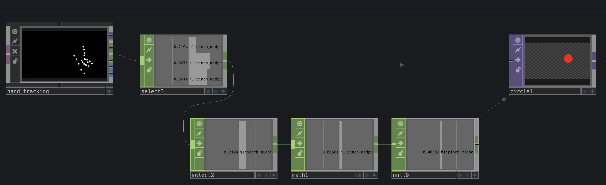
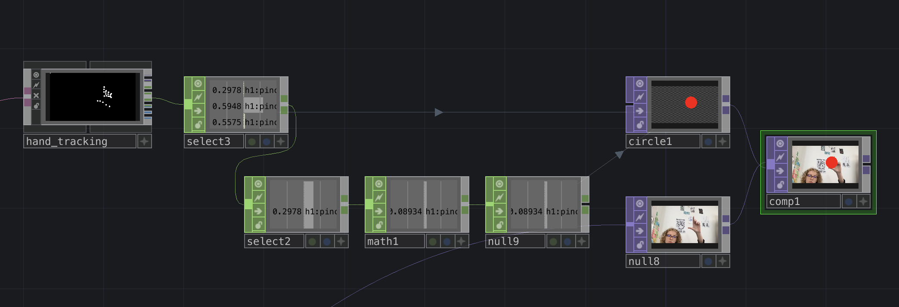

# MediaPipe for Touchdesigner

*Or how to use MediaPipe in Touchdesigner to get datas from the webcam and use them to create interactions.*

- The [introduction to Touchdesigner](https://github.com/LucieMrc/IntroTD)

## MediaPipe ???

[MediaPipe](https://developers.google.com/mediapipe) is a computer vison centered machine-learning framework.

In Touchdesigner, we can use it to get the position of a person "skeleton" in front of a webcam, and use the datas to create interactions.

The [MediaPipe documentation for TD](https://github.com/torinmb/mediapipe-touchdesigner?tab=readme-ov-file) on github, with the [presentation video](https://www.youtube.com/watch?v=Cx4Ellaj6kk&ab_channel=TorinBlankensmith).

The [download link](https://github.com/torinmb/mediapipe-touchdesigner/releases) of the latest release.

*The example file MediaPipeTouchdesigner.toe.*

## The file MediaPipeTouchdesigner.toe

### A. MediaPipe node

The MediaPipe node contains a lot of the things that makes it work, but we won't get into it.

### B. Realtime informations

The first output of the MediaPipe node is a CHOP that allows us to check the informations of time and delays.

### C. Face, hands and skeleton tracking

The tracking of one or multiple persons' faces with the node face_tracking allows us to get the position of the face and each of its points, as well as a 3D mask of the face. We track up to 5 faces.

The tracking of hands with the node hand_tracking allows us to get the position of both hands and theirs points, as well as a 3D render.

*Points from left hand and fingers*

We also get the velocity of the hands, the distance between left and right hands, and the data of "pinch" gesture in the `helpers` CHOP, as well as 8 gestures for each hand in the `gestures` CHOP.

The "skeleton" tracking with the node pose_tracking allows us to get the positions of different body parts, as well as the velocity of the wrists and hands distance. We can track up to 5 persons.

### D. Objects and faces detection

The detection and classification of objects with the node object_tracking1 is used to "see" objects on the video and recognize them with more or less confidence. It does not works very well.

*Here my phone being detected with only 55% confidence*

The face_detector1 node is used to detect faces and get the positions of each points.

The image_classification node tries to recognize objects on the image. It does not works very well.

### E. The Virtual Webcam Chain

I am not sure yet of the use of the Virtual Webcam Chain, but you can turn on the camera in the first node, the videodevin.

### F. The node image_segmentation

By turning on the parameter `Image Segmentation` in the MediaPipe node, the webcam video in the MediaPipe node becomes segmented by color depending of body parts (hands, face, hair) and the background.

In the outputs of the image_segmentation node, there is one output for each color with the shape in white on top of a transparent background. There is also the whole person on a transparent background if the camera of the Virtual Webcam Chain is turned on.

It is best to turn off `Show overlays` in the MediaPipe node to hide every detections on top of the webcam video, so they don't appear neither on the segmented parts.

## Using the data

We can for example get the position of the "pinch" (between thumb and index), and the distance measured.
We create a `select` TOP on the "helpers" (4th) output, and we select "h1:pinch_midpoint:distance" (distance between the fingers), "h1:pinch_midpoint:x" and "h1:pinch_midpoint:y (the x and y position of the midpoint of the distance between the fingers).

la valeur 0,0 sur une image sur touch c'est le milieu de l'image, sur mediapipe 0,0 c'est en bas à gauche.

recalculer les données y en 3d : faire un select avec "*:y" ( * = tout, $:y = tout ce qui finit par y )
