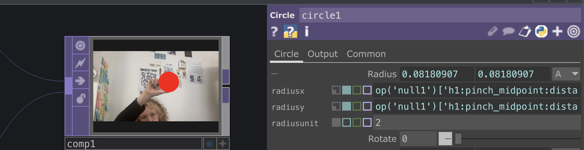

# MediaPipe for Touchdesigner

*[french version](https://github.com/LucieMrc/MediaPipe_TD_FR)*

*Or how to use MediaPipe in Touchdesigner to get datas from the webcam and use them to create interactions.*

- The [introduction to Touchdesigner](https://github.com/LucieMrc/IntroTD)

## MediaPipe ???

[MediaPipe](https://developers.google.com/mediapipe) is a computer vison centered machine-learning framework.

In Touchdesigner, we can use it to get the position of a person "skeleton" in front of a webcam, and use the datas to create interactions.

The [MediaPipe documentation for TD](https://github.com/torinmb/mediapipe-touchdesigner?tab=readme-ov-file) on github, with the [presentation video](https://www.youtube.com/watch?v=Cx4Ellaj6kk&ab_channel=TorinBlankensmith).

The [download link](https://github.com/torinmb/mediapipe-touchdesigner/releases) of the latest release.

*The example file MediaPipeTouchdesigner.toe.*

MediaPipe can therefore track hands, faces, parts of the body.

    

Les usages : exemples
    

https://github.com/user-attachments/assets/466b417f-35ff-4fdf-91bf-47f5a52e5d09

*Exemple de post instagram de [@pepepepebrick](https://www.instagram.com/pepepepebrick/?hl=fr)*

https://github.com/user-attachments/assets/58d47cc1-69da-4908-8195-8de0e032cb36

*Exemple de post instagram de [@poetengineer](https://www.instagram.com/the.poet.engineer/?hl=fr)*

## The file MediaPipeTouchdesigner.toe

### A. MediaPipe node

The MediaPipe node contains a lot of the things that makes it work, but we won't get into it.

This node gets and initializes all the trackings, we link it to the other specific nodes that filter and sort the data.

This node also allows you to activate and deactivate the tracking that you don't use to save computing power.
You should only deactivate every tracking that you don't use in the project.

### B. Realtime informations

The first output of the MediaPipe node is a CHOP that allows us to check the informations of time, delays and project performances.

### C. Face, hands and skeleton tracking

The tracking of one or multiple persons' faces with the node face_tracking allows us to get the position of the face and each of its points, as well as a 3D mask of the face. We track up to 5 faces.

The tracking of hands with the node hand_tracking allows us to get the position of both hands and theirs points, as well as a 3D render. We can only track 2 hands.

*Points from left hand and fingers*

We also get the velocity of the hands, the distance between left and right hands, and the data of "pinch" gesture in the `helpers` CHOP, as well as 8 gestures for each hand in the `gestures` CHOP.

The "skeleton" tracking with the node pose_tracking allows us to get the positions of different body parts, as well as the velocity of the wrists and hands distance. We can track up to 5 persons.

### D. Objects and faces detection

The detection and classification of objects with the node object_tracking1 is used to "see" objects on the video and recognize them with more or less confidence.

*Here my phone being detected with only 55% confidence*

The face_detector1 node is used to detect faces and get the positions of each points. It is a more light and simple detection than the face_tracking node, and we can detect up to 10 faces.

The image_classification node tries to recognize objects on the image. It does not works very well in the sense that the classification rarely works well, and when it is working the confidence is quite low.

### E. The Virtual Webcam Chain

The Virtual Webcam Chain is used to do post processing outside of TouchDesigner (in OBS for example) and re-integrate the video flux in TD.

### F. The node image_segmentation

By turning on the parameter `Image Segmentation` in the MediaPipe node, the webcam video in the MediaPipe node becomes segmented by color depending of body parts (hands, face, hair) and the background.

In the outputs of the image_segmentation node, there is one output for each color with the shape in white on top of a transparent background. There is also the whole person on a transparent background if the camera of the Virtual Webcam Chain is turned on.

It is best to turn off `Show overlays` in the MediaPipe node to hide every detections on top of the webcam video, so they don't appear neither on the segmented parts.

## Using the data

We can get the coordinates of the points detected by MediaPipe (face, hand, skeleton, etc) to create and move elements on top of the webcam image.
To do so, we can do it in 2D with TOPs or in 3D with SOPs.

## In 2D with TOPs

We deactivate everything but "Detect hands" in the `MediaPipe` node parameters as we will only use hand tracking here. Do not forget to also deactivate "Show overlays" so nothing appear on the webcam image.

We want to get the "pinch" (between thumb and index) position and its distance.
We start by creating a `Select` TOP on the "helpers" output (4th) of the `hand_tracking` node, and we select "h1:pinch_midpoint:distance", "h1:pinch_midpoint:x" and "h1:pinch_midpoint:y" (position x and y of the middle of the pinch).

Then we create a `Circle` TOP, and we change the parameter "radius" from 1 to 0.1 .
Finally, we change the resolution so it is the same as the webcam (here, 1280*720).

For the circle to move, we assign the channel "h1:pinch_midpoint:x" to the parameter "center x", and "h1:pinch_midpoint:y" to "center y".

We can see that the circle stay in the top right corner of the image instead of moving in the whole image.

Indeed, positions x and y of the midpoint are normalized (between 0 and 1), as 0,0 is the bottom left of the image.
In the textures in TouchDesigner, 0,0 is the middle of the image and positions x and y are between -0.5 and 0.5 .

We need to change the range of the channels, and to do so we create a `Select` CHOP to choose only "h1:pinch_midpoint:x", then we create a `Math` CHOP.

In the "Range" tab of the `Math` CHOP, we keep 0 and 1 for the "From Range" and we write -0.5 and 0.5 in the "To Range".

By assigning the channel "h1:pinch_midpoint:x" from the `Math` CHOP to the "center x" of the `Circle` TOP, our circle now moves in the whole image on the x axis.

To do the same for y, we create another `Select` CHOP after the previous `Select` and choose "h1:pinch_midpoint:y". Then we create a `Math` CHOP.

In the "Range" tab of the `Math` CHOP, we have to write 0.2 and 0.8 in "From Range", as it is the minimum and maximum that we see when moving the hand from top to bottom of the screen. 
We write -0.5 à 0.5 in "To Range".

By assigning the channel "h1:pinch_midpoint:x" from the `Math` CHOP to "center y" from the `Circle` TOP, our circle now moves in the whole image in the x and y axis.

We can then create a `Composite` TOP, and enter the `Circle` TOP as well as the image of the webcam in the MediaPipe node.
We use the "Over" operation in the parameters of the `Composite`. We can see the circle moving in the middle between the thumb and the index.

To have the size of the circle changing with the distance between the fingers, we assign the channel "h1:pinch_midpoint:distance" to the "radius" parameter of the `Circle` TOP.
Here, I divide by 2 the channel so the circle is smaller.

## In 3D with SOPs

There is severals ways of moving elements in 3D with MediaPipe coordinates. We choose the most suitable way depending on the number of elements, interaction between them and specific parameters of these elements.

Here, I show them from the easiest to the most complicated : [data links](#data-links), [instanciation](#instaciation), [Replicator](#replicator).

There is two common steps to the three methods :
- Modifying the parameters in the `Camera` COMP so the elements can be perfectly on top of the webcam image.
- Creating a `Composite` TOP after the `Render` TOP and the last output of the `MediaPipe` node to display our elements on top of the webcam image.

### Data links

We use the data links, the way we created the red circle in the 2D part, when we have fewer elements, and/or we want to modify the parameters of each element independently. Nevertheless, it is the slower method.

It is the method used in the "handTrackingExemple.toe" project.

At first, we need to select the coordinates of the points we want to use. Here, we want to have a sphere on the tip of each finger.

We create a `Select` CHOP at the second output of the `MediaPipe` node, and in "Channel Names" we select the channels x, y and z for each finger tip of h1 (= first hand).

For the thumb : h1:thumb_tip:x h1:thumb_tip:y h1:thumb_tip:z

For the index : h1:index_finger_tip:x etc

The same for h1:middle_finger_tip, h1:ring_finger_tip, h1:pinky_tip with x y and z for each.

Instead of listing each channel name of the coordinates, we can also just write `h1:*_tip:*`, where "*" means "everything".

So `h1:*_tip:*` = h1:[everything]_tip:[everything].

If we want to have both hands, we can do the same for h2 (and write `*_tip:*` to have [everything]_tip:[everything] ).

After the `Select`, we create a `Filter` CHOP so we can slightly smooth the channels and avoid choppy movements. We write 0.2 in the parameter "Filter Width" which means the channel is smoothed on 0.2 seconds.

The higher the value (in second) of the "Filter Width", the more there will be a "lag" effect on the movement. Do no hesitate to go back later and change the value in the `Filter` to choose a suitable movement speed.

We add a `Null` CHOP after the `Filter`.

Then, we create 5 `Sphere` SOP, which will move at the 5 fingertips. In the parameters of each SOP, we write 0.05 in Radius x, y and z.

In the parameters of the first `Sphere` SOP, we put the x y and z coordinates of the thumb from the `Null` CHOP in the parameter Center x, y and z.

We do the same for the coordinates of each finger on each sphere.

Then, we create a `Merge` SOP to gather the 5 spheres in one node.

Finally, we create a `Geo` COMP and a `Render` TOP to have the 2D render of our spheres.

For the camera, we create a `Camera` COMP and in the parameters we write 0.5 in Translate x and y, and 1 in Translate z in the first tab.

In the "View" tab of the parameter, we choose "Orthographic" in the "Projection" paramater and 1 in "Ortho Width".

We also write 0.9 in "Near" and 10 in "Far".

Without these modifications, we could not display the render on top of the webcam image.

We create a `Constant` MAT to apply a color on the `Geo`.

After the `Render` TOP, we create a `Composite` TOP in which we add the last output of the `MediaPipe` node to display the sphere on top of the webcam. We choose "Atop" as the Operation in the `Composite` parameters.

Notes:
- We could compare each spheres position to have collision events
- We could adapt the spheres size depending on the depth with the z position as it is the distance between the finger and the webcam. To do so, we write a formula with the z position in the Radius parameter of each `Sphere`.
- Instead of using a `Merge` SOP, we could create a `Geo` for each sphere and combine them in the `Render` TOP. It would allow each sphere to a different Material/different color, etc.

### Instaciation

We use instaciation when we want to create a lot of elements quickly, on which we will not be able to act individually.

We start by creating 5 `Select` CHOP. We want to get the x, y and z position of each fingertips in each `Select`.

In the "Channel Names" parameter, we write "h1:thumb_tip:*" for the first `Select` to have every channels which name start by "h1:thumb_tip:".

We do the same in the second `Select` with "h1:index_finger_tip:*" and so on for each finger.

Then, we write "x y z" in the "Rename to" parameter of the 5 `Select` CHOP so all of the channels are named "y", "y" and "z" in each `Select`.

It will allow us to create 3 channels x, y and z with 5 samples, one per finger.

We create a `Join` CHOP in which we reunite the 5 `Select` and we now see the 3 channels, x y and z.

As in the data links method, we can add a `Filter` CHOP between each `Select` and the `Join` to smooth the channels and avoid choppy movements. We can write 0.2 in the "Filter Size" parameter.

After the `Join` CHOP, we create a `Null` CHOP.

Then, we create a `Sphere` SOP, that will be the 3D shape we will instanciate.
We make it smaller by writing 0.05 in the "Radius" x, y and z parameter.

We create a `Geo` COMP, a `Camera` COMP and a `Render` COMP.

Like the data links method, we write à.5 in Translate x and y, and 1 in Translate z in the first tab of the `Camera` COMP parameters.

In the "View" tabb of the `Camera` parameters, we choose "Othrographic" in the "Projection" parameter and 1 in "Ortho Width".

We also write 0.9 in "Near" and 10 in "Far".

To create the instanciation, we activate the "Instancing" parameter in the "Instance" tab of the `Geo`.

For the 5 spheres to be created at the x, y and z position of each sample of the `Null` CHOP, we drag and drop (or write the name of the node) the `Null` into the "Translate OP" parameter.
We write x y and z respectively in the "Translate X", "Y" and "Z" parameters.

We create a Material to apply to the `Geo`, here I chose a `Constant` MAT.

In order to modify each sphere size depending on its distance to the webcam (so the size of the finger on the webcam image), we create a `Select` CHOP after the `Join` and we only select the z channel.

We then create a `Math` CHOP, and we open the "Range' tab of the parameters.

By moving the hand closer and away from the webcam, we can see that z is between 0 (hand further away) and -0.5 (hand closer).
These are the values we write in the "From Range" parameters.

I want the radius of my sphere to be divided by 2 (so multiplied by 0.5) at the furthest and multiplied by 2 at the closest, so these are the values we write in the "To Range" parameters.

We create a `Null` CHOP after the `Math`.

Back in the `Geo` parameters, we drag and drop (or write the name of the node) the second `Null` CHOP in the "Scale OP" parameter.
We write z in both the "Scale X", "Y" and "Z" parameters.

We can then see the size of the sphere changing in the `Render` TOP depending of the distance from the webcam. We can change the values in the `Math` CHOP to get the desired effect. 

As in th data links method, we create a `Composite` TOP after the `Render` TOP, in which we also link the last output of the `MediaPipe` node to display the spheres on top of the webcam image.
We select "Atop" as the "Operation" in the `Composite` parameters.

Notes:
- In the instanciation parameters, we can also modify for example the rotation and colors of each shapes created, as we did for the position and scale.

### Replicator

*[How to use the Replicator in TouchDesigner](https://github.com/LucieMrc/TD_Replicator_EN)*

We use the Replicator when we want to create a lot of elements, which we won't be able to really modify individually but we can change as many parameters as we want on all.
We also use this method with TOPs.

To use the `Replicator`, we first need to create a DAT table with our channels. We want to have as many rows as elements to be create (here 5 for the finger tips) and as many columns as coordinatees (here 3 for x, y and z).

Like for the instanciation method, we create 5 `Select` CHOP, 1 for each fingertip with x, y and z, rename them and group them into a `Join` CHOP.

We can also add `Filter` CHOP between the `Select` and the `Join`.

We then create a `CHOP to` DAT, and we drag and drop the `Join` CHOP to create a data link.

We then have our table with 5 rows and 3 columns.

We create a `Replicator` COMP and we drag and drop the `CHOP to` on the "Template DAT Table" parameter.

We then create the "Master Operator" that the Replicator will recreate. Dependings on the complexity of the Master and the parameters we want to modify, we can either :
- Create just a sphere and combine all the spheres in a `Merge` SOP
- Create a `Base` COMP that will contain our sphere and other elements, that we will combine in one `Geo` at the end. It is useful if we want multiple geometry, like a sphere + a cube on each finger.
- Create a `Base` COMP that will contain our sphere, a `Geo` and a `Render`, and we will combine all the `Render` at the end. It is useful if we want to apply a different Material on each element.

Here, I want to use the last method to create a sphere and a circle with different Materials.

We start by creating a `Base` COMP, in which we can enter by double-clicking or pressing "i" when selected.
To exit te base, we can dezoom a lot or press "u".

We drag and drop the `Base` on the "Master Operator" parameter of the `Replicator`, and we deactivate the parameter "Ignore First Row".

We should now see 5 nodes named `item0` to `item4` as the Replicator have recreated the Master Operator once for each row in the DAT table.

We then enter in the Master Operator `Base` Master Operator. We start by creating a `Select` DAT to get the DAT table of coordinates.
We write "../chopto1" in the "DAT" parameter to get the node "chopto1" of the parent of the `Base` (= outside the `Base`).

We create a `DAT to` CHOP, and we drag and drop the `Select` DAT on the "DAT" parameter.
We want to select only the row of the item we created, and have 3 channels : x, y and z.

We start by selecting "Channel per Column" in the "Output" parameter, and select "Values" in the "First Column is" parameter. 
We therefore create as many channels as there is columns and we specify that the first column doesn't contains names but values.

To only select the item row, we choose "By Index" in the "Select Rows" parameter.
In "Start Row Index" and "End Row Index", we write "me.parent().digits".

"me.parent().digits" = the index/number of the parent component. Here, the `Base` is named "Base1" so me.parent().digits = 1.
For "item0", it will be 0, for "item4" it will be 4, and so on.

If we were to write "me.digits", it would 1 for each as the node itself is named "datto1", but it would be 8 is the node was named "datto8" and so on.

We can add a `Rename` CHOP after the `DAT to` to rename our 3 channels x, y and z.

Now that we have the position coordinates, we can create a `Sphere` SOP and a `Circle` SOP.

I wrote 0.02 in the Radius x, y and z of the `Sphere` and 0.04 in the Radius x and y of the `Circle`.

In the Center x, y and z parameter of the `Sphere` and the `Circle`, we put the x, y and z channels from the `Rename` CHOP.
We can now see them move if I move my hand.

As we want different Materials for the sphere and the circle, we create a `Geo` COMP for each, but only one `Render` TOP and one `Camera` COMP.
Comme je vais vouloir des Material différents pour la sphère et le cercle, on crée un `Geo` COMP pour chaque, mais un seul `Render` TOP et un seul `Camera` COMP.

Like in the previous methods, we change the default parameters in the `Camera` COMP. We write à.5 in Translate x and y, and 1 in Translate z in the first tab.
In the "View" tabb of the `Camera` parameters, we choose "Othrographic" in the "Projection" parameter and 1 in "Ortho Width".
We also write 0.9 in "Near" and 10 in "Far".

We then create a `Wireframe` MAT for the sphere `Geo` Material, and we select "Topology Wireframe" in the "Wireframe Mode" parameter.

We also create a `Line` MAT for the circle `Geo` Material.

When we look at the `Render` TOP, we now have the circle around the wireframe sphere.

We can exit the `Base`, and click on "All" in the "Recreate All Operators" of the `Replicator`.
If we enter in any of the `item`, we can now see the same network but with a different coordinates row.

Next to the `Replicator`, we create a `Composite` TOP. In the "TOPs" paramter, we write "item*/render1" to select all the "render1" nodes in the nodes which name starts with "item".
We choose "Over" as Operation, and we can now see our 5 elements.

We create a new `Composite` TOP, in which we also link the last output from the `MediaPipe` node, in order to display the spheres + circles on top of the webcam image. We choose "Atop" as "Operation" in the `Composite` parameters.

Notes:
- We could also have modified the scale of the elements depending on the distance from the hand to the webcam with the z coordinate as we did in the instanciation method.
- We could have created `Circle` TOPs instead of doing 3D.
- After each modification of the `Base` Master Operator, we need to recreate the items by clicking "All" on the "Recreate All Operators" of the `Replicator` to update them.

# To go further

<!-- recalculer les données y en 3d : faire un select avec "*:y" ( * = tout, *:y = tout ce qui finit par y)-->

- Separate the background and [Dither yourself](https://github.com/LucieMrc/Dither_touchdesigner)
